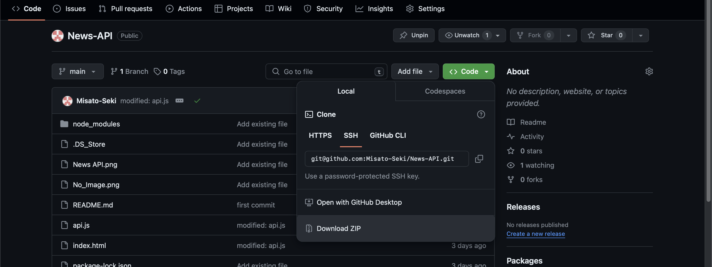
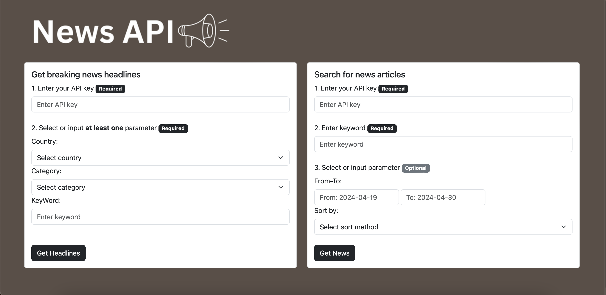

# News-API

News-API is a program that retrieves news from the News API.

## Installation

### For *Free* Account Holders of NewsAPI
Free account holders have CORS enabled for localhost which means requests can be made only while testing from localhost.
1. Click "Code" above the list of files.
2. Click  "Download ZIP".
3. Open your preferred web browser. 
4. In the menu bar, click on “File” and then click on “Open File…” (or equivalent). 
5. Navigate to "index.html" file and then click “Open” (or equivalent). 

### For *Paid* Account Holders of NewsAPI
Paid account holders have CORS enabled for all origins which means requests can be made from all origins.
1. https://misato-seki.github.io/News-API/

## Usage

1. News-API offers 2 options:
2. "Get breaking news headlines": Retrieve all the current **news related to a chosen country and category** from the API.
3. "Search for news articles": Find all the **news related to a user input ketword** from the API.
4. An API key is required. If you do not have one, please obtain it from [NewsAPI](https://newsapi.org).

## Contributing

Pull requests are welcome. For major changes, please open an issue first
to discuss what you would like to change.

Please make sure to update tests as appropriate.

## License

[MIT](https://choosealicense.com/licenses/mit/)
